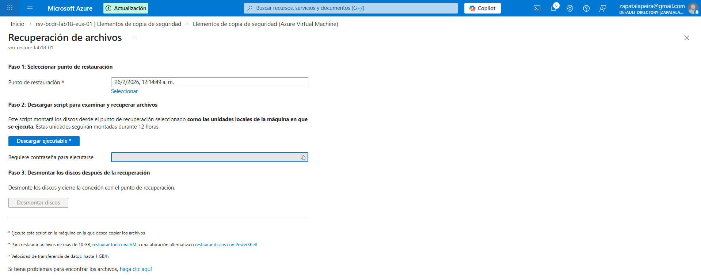
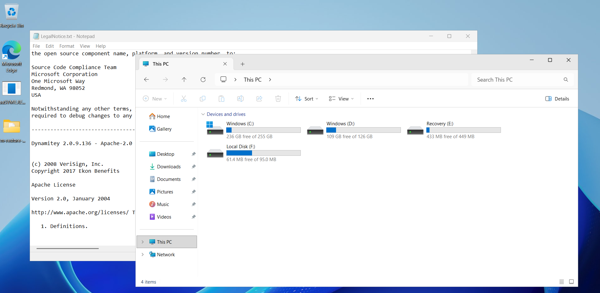

# Lab 35 - Recuperación de un archivo desde Azure Backup sin restaurar toda la VM

En este laboratorio he probado la recuperación de un archivo concreto desde Azure Backup usando la opción de File Recovery.

La idea aquí es bastante útil: si lo que necesitas es recuperar solo un archivo o una carpeta, no tiene sentido restaurar la máquina virtual completa. Con File Recovery puedes montar un punto de recuperación y sacar solo lo que necesitas, que al final es mucho más rápido y práctico.

## Qué he hecho

He entrado en el backup de una máquina virtual protegida, he generado el script de File Recovery y lo he usado para montar el punto de recuperación. Una vez montado, he podido acceder al contenido y recuperar el archivo que me interesaba.

## Capturas

### Script de File Recovery generado

### Unidad montada y archivo recuperado

## Nombre de los archivos

`images/01-file-recovery-script.png`  
`images/02-drive-mounted-file-recovered.png`

## Qué se ve en la evidencia

En la primera captura se ve la generación del script necesario para iniciar la recuperación de archivos desde el punto de backup.

En la segunda se ve el punto de recuperación ya montado como unidad para el acceso al archivo recuperado.

## Cómo lo explicaría en una entrevista

Lo explicaría como una forma muy práctica de recuperar información sin tener que hacer una restauración completa de la máquina. Para incidencias puntuales, como un archivo borrado o dañado, File Recovery permite ir directamente a lo que necesitas y ahorrar bastante tiempo.
